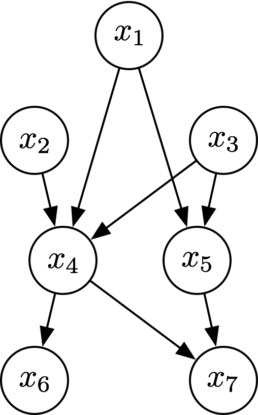

# 网易游戏雷火事业群笔试题-人工智能工程师+研究员

## 选择题

1. 下面关于随机森林（RF）与梯度提升树（GBDT）区别说法错误的是

    - [x] 随机森林对异常值敏感，而GBDT对异常值不敏感
    - [ ] 组成随机森林的树可以并行训练生成，而GBDT是串行训练生成的
    - [ ] 组成随机森林的树可以分类树也可以是回归树，而GBDT只由回归树组成
    - [ ] RF是通过减少模型的方差来提升性能，而GBDT是通过减少模型的偏差来提高性能的

    > 随机森林(Random Forests)是一个包含多个决策树(decision tree)的分类器，其输出的类别由个别树输出的类别的众数决定。
    >
    > GBDT（Gradient Boost Decision Tree）是以决策树为基学习器的迭代算法，注意GBDT里的决策树都是回归树而不是分类树。GBDT的核心就在于，其每一棵树学的是之前所有树结论和的残差，这个残差就是一个加预测值后能得真实值的累加量。
    >
    > - A；错误，随机森林对异常值不敏感；GBDT对异常值非常敏感。
    >   - 作为构建的一部分，随机森林预测器自然会导致观测值之间的不相似性度量。还可以定义未标记数据之间的随机森林差异度量：其思想是构造一个随机森林预测器，将“观测”数据与适当生成的合成数据区分开来。观察到的数据是原始的未标记数据，合成数据是从参考分布中提取的。随机森林的不相似性度量之所以吸引人，是因为它能很好地处理混合变量类型，<u>对输入变量的单调变换是不敏感的</u>，而且对异常数据是鲁棒的。由于其固有变量的选择，随机森林不相似性很容易处理大量的半连续变量。
    > - B：正确
    >   - 随机森林中的决策树可以在一个数据集上的不同部分进行并行训练。
    >   - 由于弱分类器的串行依赖，导致GBDT难以并行训练数据。
    > - C：正确
    >   - 组成随机森林的树可以分类树也可以是回归树。
    >   - GBDT只由回归树组成，用以回归之前所有树结论和的残差。
    > - D：正确
    >   - 生长很深的树容易学习到高度不规则的模式，即过学习，在训练集上具有低偏差和高方差的特点。<u>随机森林是平均多个深决策树以降低方差的一种方法</u>，其中，决策树是在一个数据集上的不同部分进行训练的。这是以偏差的小幅增加和一些可解释性的丧失为代价的，但是在最终的模型中通常会大大提高性能。
    >
    > **Reference**:
    >
    > - [梯度提升决策树（GBDT）和随机森林（RF）的异同](http://www.voidcn.com/article/p-ziskezwh-bpx.html)
    > - [随机森林 - 维基百科](https://zh.wikipedia.org/wiki/%E9%9A%8F%E6%9C%BA%E6%A3%AE%E6%9E%97)

2. 关于L1、L2正则下列说法正确的是：

    - [x] L1正则先验服从拉普拉斯分布，能够实现特征选择
    - [ ] L2正则先验服从拉普拉斯分布，不能实现特征选择
    - [ ] L1正则先验服从高斯分布，不能实现特征选择
    - [ ] L2正则先验服从高斯分布，能够实现特征选择

    > - L1正则先验服从拉普拉斯分布，L2正则先验服从高斯分布。
    > - L1能实现特征选择，而L2不能。
    >   - L1通常导致稀疏解，即稀疏的模型，使得参数里有很多的0，这些为0的特征可以理解为与问题相关性很小，这起到了一种特征选择的作用。
    >   - L2虽然也限制参数，但L2下参数保持非0的状态，向0靠近，但依旧不是0，也可以理解为L2认为所有特征都是有用的，只是相关性大小不同。
    >
    > **Reference**:
    >
    > - [L1和L2正则化](http://oath2yangmen.online/2018/01/26/L1%E5%92%8CL2%E6%AD%A3%E5%88%99%E5%8C%96/)
    > - [Quora上讨论L1与L2的问题](https://www.quora.com/Machine-Learning/What-is-the-difference-between-L1-and-L2-regularization-How-does-it-solve-the-problem-of-overfitting-Which-regularizer-to-use-and-when#wpdftVBY8)

3. 关于BatchNorm和LayerNorm说法错误的是
    - [ ] BatchNorm实际使用时需要计算并且保存某一层神经网络batch的均值和方差等统计信息
    - [ ] LayerNorm是针对深度网络的某一层的所有神经元的输入进行Normalize操作
    - [ ] BatchNorm对batch size的大小比较敏感
    - [x] LayerNorm实际使用时需要计算并且保存某一层神经网络batch的均值和方差等统计信息

    > LayerNoem不需要保存训练时的均值与方差
    >
    > **Reference**:
    >
    > - [Neural network normalization](https://nealjean.com/ml/neural-network-normalization/)

4. 马尔可夫决策过程中的状态转移具有马尔科夫性质具体是指，对于任意时间步骤$t​$上的状态$s_t$，有

$$
Pr(s_t | s_0, a_1, s_1, \ldots, s_{t-1}, a_t) = \prod^t_{t=1} Pr(s_{t'} | s_{t'-1},a_{t'})
$$


5. 以下哪个为GAN中判别器的loss

$$
-\mathbb{E}_{x\sim p_d} [log(D(x))] - \mathbb{E}_{\tilde{x}\sim p_g} [log(1-D(\hat{x})]
$$

6. 在卷积神经网络计算中，已知输入特征层大小为$W\times H \times C = 16\times 16\times 32$，使用标准卷积计算，带偏置项，卷积核大小为$3\times 3$，输出特征层数目为$64$，请问卷积层的参数个数为？

    - [x] 18496
    - [ ] 73728
    - [ ] 576
    - [ ] 18432

    > **Convolutional Layer** : Consider a convolutional layer which takes “l” feature maps as the input and has “k” feature maps as output. The filter size is “**n\*m**”.
    > Here the input has **l=32** feature maps as inputs, **k=64** feature maps as outputs and filter size is **n=3 and m=3**. It is important to understand, that we don’t simply have a 3*3 filter, but actually, we have **3\*3\*32** filter, as our input has 32 dimensions. And as an output from first conv layer, we learn 64 different **3\*3\*32** filters which total weights is “**n\*m\*k\*l**”. Then there is a term called bias for each feature map. So, the total number of parameters are “**(n\*m\*l+1)\*k**”.
    >
    > **Ans**: $(3\times 3 \times 32 + 1) \times 64 = 18496$
    >
    > **Reference**:
    >
    > - [How to calculate the number of parameters in the CNN?](https://medium.com/@iamvarman/how-to-calculate-the-number-of-parameters-in-the-cnn-5bd55364d7ca)

7. 对于如下一个卷积网络`input -> k=1,s=2 -> k=2,s=2 -> k=3,s=2 -> k=4,s=2 -> feature map`，第四层feature map的感受野的大小为（$k$表示卷积核大小，$s$表示步长）。

    - [ ] 34
    - [ ] 68
    - [x] 35
    - [ ] 70

    > - $O = [\frac{I + 2\times p - k}{s}] + 1$
    > - $I = s \times (O - 1) + k - 2\times p​$
    > - from 1 pixel in feature map to input: $1\to 4 \to 9 \to 18 \to 35​$
    >
    > Reference:
    >
    > - [A guide to receptive field arithmetic for Convolutional Neural Networks](https://medium.com/mlreview/a-guide-to-receptive-field-arithmetic-for-convolutional-neural-networks-e0f514068807)


8. 下列排序方法属于稳定排序的是

    - [x] 归并排序
    - [ ] 快速排序
    - [ ] 选择排序
    - [ ] 堆排序

    > - 稳定排序：冒泡、插入、桶、计数、归并、二叉排序树、基数
    >
    > - 不稳定的排序：选择、希尔、堆、快速
    >
    > Reference:
    >
    > - [排序算法 - 维基百科](https://zh.wikipedia.org/wiki/%E6%8E%92%E5%BA%8F%E7%AE%97%E6%B3%95)

9. MYSQL删除表中数据及表结构的语句是

    - [ ] `DELETE S`
    - [x] `DROP TABLE S`
    - [ ] `DELETE TABLE S`
    - [ ] `TRUNCATE TABLE S`

    > - **DELETE:** It is a DML command that is used to remove the data from a table. It can be used in conjunction with WHERE to delete only the rows meeting the specified criteria.
    >
    > - **TRUNCATE:** It is a DDL which is used to remove ALL the rows from a table. However, it does not delete the table.
    >
    > - **DROP:** It is used t remove the data as well as the table from the database.
    >
    > Reference:
    >
    > - [What is the main difference between Truncate, Delete and Drop in a database?](https://www.quora.com/What-is-the-main-difference-between-Truncate-Delete-and-Drop-in-a-database)

10. 下面有关分类算法的精确率、召回率、F1值的描述，错误的是
    - [x] 召回率是指检索出的相关文档数和检索出的文档总数的比率，衡量的是检索系统的查全率
    - [ ] 为了解决准确率和召回率的平衡问题，引入了$F1$值
    - [ ] 精确率是指检索出相关文档数与检索出的文档总数的比率，衡量的是检索系统的查准率
    - [ ] 精确率、召回率取值都在0和1之间，越接近于1，指标就越好

    > - 准确率（Precision）：P=TP/(TP+FP)。通俗地讲，就是**预测正确的正例数据**占**预测为正例数据**的比例。
    > - 召回率（Recall）：R=TP/(TP+FN)。通俗地讲，就是**预测为正例的数据**占**实际为正例数据**的比例
    > - F1值（F1 score）：$\text{F1} = \frac{2}{1/P+1/R} = \frac{2PR}{P+R}$，是精确率和召回率的调和均值
    > - ROC曲线（Receiver operating characteristic curve）：TPR（True positive rate）和FPR（False positive rate）
    > - AUC曲线（Area Under Curve）的值为ROC曲线下面的面积，若如上所述模型十分准确，则AUC为1。

11. 小明建立了一个比较简单的CNN模型，共3层，每层都采用$\text{kernel size} = 3\times 3​$，$ \text{stride}=1​$，padding的设置分别为$0,1,0​$。当输入为一个$32\times 32​$的图片时，请问输出的维度是多少（不考虑channel）？小明由于粗心大雨，将输入图像的每个位置的值都设成了1，而kernel的每个weight采用了random的初始化方式，请问网络第一次前向传播时会输出怎样的结果？
      - [ ] $28\times 28$；输出的每个位置可能不同
      - [x] $28\times 28​$；输出的每个位置都是一样的
      - [ ] $32\times 32​$；输出的每个位置都是一样的
      - [ ] $32\times 32​$；输出的每个位置可能不同

     > 1. $32\to 30\to 30\to 28$
     > 2. weights经过随机初始化后是fixed，对每个位置来说，如果输入相同，则经过同一个卷积核，其卷积结果也相同。

12. 随机梯度下降算法中引入动量后，假设达到最终速度，则该速度是原来的多少倍（假设动量参数为$\alpha​$）？
       - [ ] $1-\alpha$
       - [ ] $1/\alpha$
       - [ ] $\alpha$
       - [x] $1/(1-\alpha)$

       > 在时间步$t>0$，动量法对每次迭代的步骤做如下修改 
       > $$
       > \begin{aligned}
       > \boldsymbol{v}_t &\leftarrow \gamma \boldsymbol{v}_{t-1} + \eta_t \boldsymbol{g}_t, \\
       > \boldsymbol{x}_t &\leftarrow \boldsymbol{x}_{t-1} - \boldsymbol{v}_t,
       > \end{aligned}
       > $$
       >
       > 对动量法的速度变量做变形
       > $$
       > \boldsymbol{v}_t \leftarrow \gamma \boldsymbol{v}_{t-1} + (1 - \gamma) \left(\frac{\eta_t}{1 - \gamma} \boldsymbol{g}_t\right).
       > $$
       > 由指数加权移动平均的形式可得，速度变量***v***tvt实际上对序列$\{\eta_{t-i}\boldsymbol{g}_{t-i} /(1-\gamma):i=0,\ldots,1/(1-\gamma)-1\}$做了指数加权移动平均。换句话说，相比于小批量随机梯度下降，动量法在每个时间步的自变量更新量近似于将前者对应的最近$1/(1-\gamma)$个时间步的更新量做了指数加权移动平均后再除以$1-\gamma​$。所以，在动量法中，自变量在各个方向上的移动幅度不仅取决当前梯度，还取决于过去的各个梯度在各个方向上是否一致。
       >
       > Reference:
       >
       > - [Momentum](https://zh.d2l.ai/chapter_optimization/momentum.html)

13. 假设Double Q-Learning的值函数为$Q^A$和$Q^B$，对于样本$(s, a, r, s')$，如果当前随机选择更新值函数值$Q^A$，则其更新方式为：

$$
Q^A (s,a) \leftarrow (1-\alpha) Q^A (s,a) + \alpha (r + \gamma Q^B(s', a^*)), a^* = \text{argmax}_{a'} Q^A (s', a')
$$

14. 标准BP算法采用的是最速梯度下降法修正权值，该算法存在于输入样本的顺序有关、收敛速度缓慢、易陷入局部极小等缺陷。为了克服算法中的不足，研究者们提出了许多改进算法，其中（）算法与其他三个算法的原理不一样。

    - [ ] 附加动量的改进算法
    - [ ] 基于Levenberg-Marquardt的改进算法
    - [ ] 基于共轭梯度法的改进算法
    - [x] 使用拟牛顿法的改进算法

    > 拟牛顿法属于二阶优化算法，其他都是一阶方法。

15. 假设某大学的食堂有若干个窗口，售卖多种加个固定的套餐，但是每天每个窗口只会出售其中一种。同时，你在各个窗口的消费还会得到折扣，折扣的具体数据只取决于当前和上一次买饭所在的窗口。你需要在该大学停留若干天，每天在食堂就餐一次，并且你知道每天每个窗口的菜单和折扣方案。请问，以下哪种方法，可以计算出每天买饭窗口的序列，使得总的花费最少。

    - [ ] Viterbi算法
    - [ ] 反向传播
    - [ ] 贪心法
    - [x] Dijkstra算法

## 不定向选择

1. 下面关于B-和B+树的叙述中，正确的有

    - [x] B-树和B+树都可用于文件的索引结构
    - [ ] B-树和B+树都能有效地支持顺序检索
    - [x] B-树和B+树都能有效地支持随机检索
    - [x] B-树和B+树都是平衡的多叉树

    > Reference:
    >
    > - [nowcoder上的原题](https://www.nowcoder.com/questionTerminal/e8edc32b062f4e3b919f969a000d77cc?from=14pdf)

2. Python中，下列选项中能够将嵌套列表`[[1, 2, 3], [4, 5, 6]]`转换成`[[1, 4], [2, 5], [3, 6]]`的有：

    - [x] `list(map(lambda x: [x, x + 3], L[0]))`
    - [ ] `[x for x in L]`
    - [x] `list(map(list, zip(*L)))`
    - [ ] `reduce(lambda x,y: [x, y], L)`

3. 深度学习训练过程中，loss会出现`NaN`，可能的原因有：

    - [x] 使用的网络过大
    - [ ] 学习率过小
    - [x] 学习率过大
    - [x] loss为交叉熵损失的情况下，训练数据中的label范围超过定义网络时设置的label范围

4. 机器学习中，当训练样本类别不平衡时，常采用的方法有：

    - [x] 使用树模型或是基于树的Boosting模型
    - [ ] 增大模型的容量
    - [x] 对样本进行过采样/欠采样
    - [x] 对损失函数进行加权处理

    > Reference:
    >
    > - [8 Tactics to Combat Imbalanced Classes in Your Machine Learning Dataset](https://machinelearningmastery.com/tactics-to-combat-imbalanced-classes-in-your-machine-learning-dataset/)

5. 以下优化算法是一阶算法的有

    - [x] Adam算法
    - [ ] 牛顿法
    - [x] 随机梯度法
    - [ ] BFGS方法

6. 关于PCA，说法正确的有

    - [ ] 对于PCA处理后的特征，其朴素贝叶斯特征相互独立的假设一定成立，因为所有主成分都是正交的，所以不相关
    - [x] 应该选择使模型具有最大方差的主成分
    - [x] 在使用PCA之前，我们必须标准化数据
    - [x] 可以使用PCA在低维空间中可视化数据

    > - A：错误。考查的是PCA和朴素贝叶斯的基本概率和区别。这句话有两处错误：
    >   - 一是 PCA 转换之后的特征不一定不相关；
    >   - 二是不相关并不等价于相互独立。
    >
    >   正交和不相关没有必然关系，只有当一个随机变量的统计平均等于零时，正交和不相关等价。
    >
    >   独立则必定不相关，而不相关却不一定互相独立，只有是高斯时独立和不相关才等价。
    >
    > - B：正确。因为我们总是选择方差最大的主成分。可以这么来理解，方差越大，说明在该特征上分布越广泛，说明该特征月有用，影响越大。
    >
    > - C：正确。PCA 对数据中变量的尺度非常敏感，因此我们需要对各个变量进行标准化。方法是减去各自变量的均值，除以标准差。
    >
    > - D：正确。PCA 有时在较低维度上绘制数据是非常有用。例如我们可以提取前 2 个主要组成部分，然后在二维平面上使用散点图可视化数据。
    >
    > Reference:
    >
    > - [机器学习笔试题精选（六）](https://zhuanlan.zhihu.com/p/41527631)

7. 下面关于Hive的说法正确的有

    - [ ] Hive可以直接使用SQL语句进行相关操作
    - [ ] Hive在加载数据过程中不会对数据进行任何的修改，只是将数据移动到HDFS中Hive指定的目录下
    - [x] Hive是基于Hadoop的一个数据仓库工具可以将结构化的数据文本应设为一张数据库表，并提供简单的SQL查找功能
    - [ ] Hive能够在大规模数据集上实现低延迟快速的查询

    > - A：错误。Hive使用类sql语句进行相关操作，称为HQL，它允许熟悉 SQL 的用户查询数据。同时，这个语言也允许熟悉 MapReduce 开发者的开发自定义的 mapper 和 reducer 来处理内建的 mapper 和 reducer 无法完成的复杂的分析工作。
    >
    > - D：错误。Hive 构建在基于静态批处理的Hadoop 之上，Hadoop 通常都有较高的延迟并且在作业提交和调度的时候需要大量的开销。因此，Hive 并不能够在大规模数据集上实现低延迟快速的查询，例如，Hive在几百MB 的数据集上执行查询一般有分钟级的时间延迟。Hive 并不适合那些需要低延迟的应用，例如，联机事务处理（OLTP）。


8. C++中关于指针和引用的描述正确的有：
    - [x] 引用不可以被重新赋值
    - [x] 指针可以在任何时候被初始化
    - [x] 引用必须指向一个对象
    - [x] 指针可以用`const`修饰

9. 关于GNN（Graph Neural Network）说法正确的有：
    - [ ] GNN可以生成Graph的特征向量描述
    - [ ] GNN是一种处理非结构化数据的神经网络方法
    - [ ] GNN可以不需要节点标签进行训练，是一种无监督的方法
    - [ ] GNN是一种Transductive learning的方法，无法做inductive inference

10. 现有贝叶斯网络如下，以下说法正确的是

    

    - [ ] $x_1$和$x_2$在$x_4$给定的条件下独立
    - [ ] $x_3$和$x_7$在$x_5$给定的条件下独立
    - [ ] $x_1, x_2, \ldots, x_7$的联合分布为$p(x_1, x_2, x_3, x_4, x_5, x_6, x_7) = p(x_1)p(x_2)p(x_3)p(x_4 | x_1, x_2, x_3) p(x_5|x_1, x_3)p(x_6|x_4)p(x_7|x_4, x_5)$
    - [ ] $x_6$和$x_7$在$x_4​$给定的条件下独立

11. 关于集成学习，以下说法正确的有

     - [x] Boosting在每一轮学习中会根据样本分布对训练集进行重采样
     - [ ] 其他都正确
     - [x] 集成学习通常比单一学习器有更好的泛化能力
     - [ ] 随机森林只用于分类任务，而Gradient Boosting只用于回归任务

12. 以下叙述正确的有

     - [x] 记$X$和$Y$的样本协方差为$Cov(X, Y)$，若$Cov(X_1, Y_1)>Cov(X_2, Y_2)$，则$X_1$和$Y_1$的相关性大于$X_2$和$Y_2$
     - [ ] 若变量$X$和$Y$的期望值符合$E(XY)=E(X)E(Y)$，则$X$和$Y$相互独立
     - [x] 多个独立的一元正态分布的联合分布为正态分布
     - [x] 若$X$和$Y$为两个独立的随机变量，则它们的方差满足$D(X+Y)=D(X)+D(Y)$

## 填空题


1. 请用一行python代码给出下列字典中对应值最大的十个键的列表

```python
# input
d = {
    'a': 63,
    'b': 76,
    'c': 74,
    'd': 33,
    'e': 53,
    'f': 27,
    'g': 16,
    'h': 13,
    'i': 3,
    'j': 28,
    'k': 40,
    'l': 1,
    'm': 35,
    'n': 46,
    'o': 41,
    'p': 5,
    'q': 73,
    'r': 8,
    's': 38,
    't': 76,
    'u': 92,
    'v': 83,
    'w': 0,
    'x': 50,
    'y': 95,
    'z': 58
}
# output ['y', 'u','v', 'b', 't', 'c', 'q', 'a', 'z', 'e']
```

> Ans: `sorted(d, key=d.get, reverse=True)[:10]`

2. 请利用shell指令将`/var/log/test.log`文件中的字符串`company/group`替换为`NetEase/Game`:

> Ans: `sed -i 's/company\/group/NetEase\/Game/' /var/log/test.log`

3. 有2个3位数字密码锁（即000-999）A和B，其中一个是坏的打不开，另一个有唯一的正确密码可以打开。你已经在A上试了000-399没有打开，请问你再在B上试000-399能打开的概率是（$1/4$）

4. 已知一个已经存放好、长度为n的数组，首尾元素都小于其相邻元素，并且没有两个相邻元素相等。现在要求你找出一个元素，使其大于它两侧的元素。问：在最坏情况下，最快的方法是什么？它的时间复杂度如何？

5. $X_1, \ldots, X_{36}$是取自正态总体$N(\mu, 0.04)$的简单随机样本，假设检验$H_0: \mu= 0.5$，备择假设$H_1: \mu> 0.5$，检验的显著水平$\alpha = 0.05$，检验的拒绝域为$\bar{x}>c$，则$c=?$。若$\mu_1=0.65$，则犯第二类错误的概率$\beta=?$。

    - 提示:$\phi(1.645) =0.95, \phi(2.856) = 0.9979$
    - 小数点后全部保留

## 编程题

### 第k个字典排序的正整数

输入正整数$n​$和$k​$，$n\ge k​$，找出$[1,n]​$范围内按照字典排序的最小第$k​$个值。

Example

- Input: 15,3
- Ouput: 11
- Explaination: [1, 10, 11, 12, 13, 14, 15, 2, 3, 4, 5, 6, 7, 8, 9]

#### Solution 1

先将正整数$i\in[1,n]$转化为`str`类型，`str`类型的排序是按照字典排序的，而后输出第$k$个值即可。

> 需要注意的是，如果使用`sorted()`方法，则会新生成一个`list`，导致在某些test case中会超出空间限制。

```python
# read inputs
n, k = list(map(int, input().strip().split(',')))
# convert to string
s = [str(i) for i in range(1, n + 1, 1)]
# sort list of strings in dictionary order
s.sort()
# print output
print(s[k - 1])
```

#### Solution 2

采用常规思路

```python
# read inputs
n, k = list(map(int, input().strip().split(',')))
# initialize the result with 1
# (the first element in dictionary order)
result = 1
k -= 1
# loop until the k-th element in dictionary order is found
while k != 0:
    # find an interval of k
    left, right = result, result + 1
    # get number of integers in this interval
    num = 0
    while left <= n:
        num += min(n + 1, right) - left
        left *= 10
        right *= 10
    # if k is in this interval
    if num > k:
        result *= 10
        k -= 1
    # or k is not in this interval
    else:
        k -= num
        result += 1
print(result)
```

### Peak Index in a Mountain Array

给定一个数组，代表海拔高度，输出最长连续山脉的长度。以山脉M为例, 要求：

- $M.length>=3​$,如果不存在则输出$0​$;

- 存在$0 < i < M.length -1$,使得$M[0] < \ldots< M[i] > \ldots> M[M.length -1]$。

Example 1:

- Input: 2, 1, 7, 2, 5
- Output: 3

Example 2:

- Input: 2, 1, 7, 7, 2, 5
- Output: 0

参见[leercode第845题](https://leetcode.com/problems/longest-mountain-in-array/)：

- Time Complexity: $O(N)$, where $N$ is the length of `a`.
- Space Complexity: $O(1)​$.

```python
# read inputs
a = list(map(int, input().strip().split(',')))

# basic case
if len(a) < 3:
    print(0)

# find longest mountain in array
# by searching mountains one by one
length = len(a)
ans = base = 0
while base < length:
    end = base
    # if base is a left-boundary
    if end + 1 < length and a[end] < a[end + 1]:
        # set end to the peak of this potential mountain
        while end + 1 < length and a[end] < a[end + 1]:
            end += 1

        # if end is really a peak
        if end + 1 < length and a[end] > a[end + 1]:  
            # set 'end' to right-boundary of mountain
            while end + 1 < length and a[end] > a[end + 1]:
                end += 1
            # record candidate answer
            ans = max(ans, end - base + 1)

    base = max(end, base + 1)

print(ans)

```

